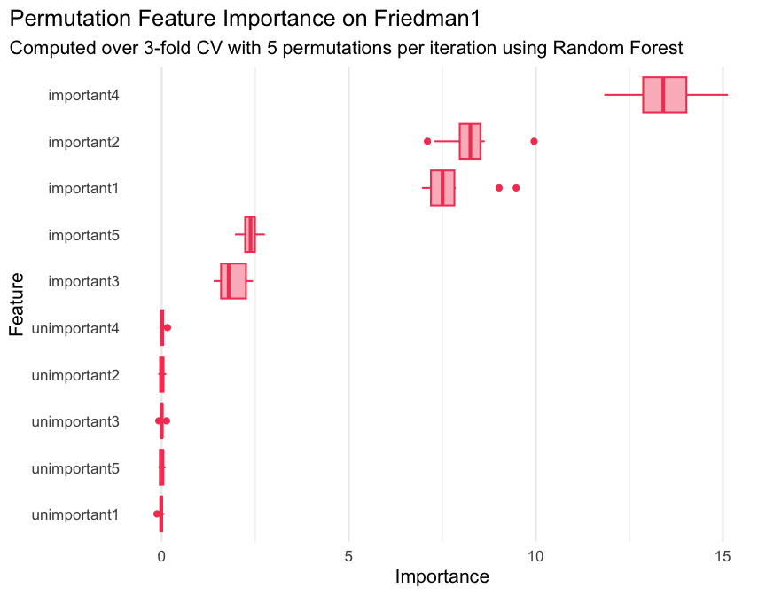

<!-- README.md is generated from README.Rmd. Please edit that file -->

# `xplainfi`

<!-- badges: start -->

[](https://lifecycle.r-lib.org/articles/stages.html#experimental)
[](https://github.com/jemus42/xplainfi/actions/workflows/R-CMD-check.yaml)
[](https://codecov.io/gh/jemus42/xplainfi)
<!-- badges: end -->

The goal of `xplainfi` is to collect common feature importance methods
under a unified and extensible interface.

It is built around [mlr3](https://mlr-org.com/) as available
abstractions for learners, tasks, measures, etc. greatly simplify the
implementation of importance measures.

## Installation

You can install the development version of `xplainfi` like so:

``` r
# install.packages(pak)
pak::pak("jemus42/xplainfi")
```

## Example: PFI

Here is a basic example on how to calculate PFI for a given learner and
task, using repeated cross-validation as resampling strategy and
computing PFI within each resampling 5 times on the `friedman1` task
(see `?mlbench::mlbench.friedman1`).

The `friedman1` task has the following structure:

$$y = 10 \sin(\pi x_1 x_2) + 20(x_3 - 0.5)^2 + 10x_4 + 5x_5 + \varepsilon$$

Where $x_{1,2,3,4,5}$ are named `important1` through `important5` in the
`Task`, with additional numbered `unimportant` features without effect
on $y$.

``` r
library(xplainfi)
library(mlr3learners)
#> Loading required package: mlr3

task = tgen("friedman1")$generate(1000)
learner = lrn("regr.ranger", num.trees = 100)
measure = msr("regr.mse")

pfi = PFI$new(
  task = task,
  learner = learner,
  measure = measure,
  resampling = rsmp("cv", folds = 3),
  iters_perm = 5
)
```

Compute and print PFI scores:

``` r
pfi$compute()
#> Key: <feature>
#>          feature    importance         sd
#>           <char>         <num>      <num>
#>  1:   important1  7.9320281224 0.77703482
#>  2:   important2  8.1368297554 0.65578878
#>  3:   important3  1.9003588453 0.35593120
#>  4:   important4 13.5083721272 0.73670025
#>  5:   important5  2.2748507393 0.24176933
#>  6: unimportant1 -0.0004293556 0.03863355
#>  7: unimportant2  0.0219242406 0.04763718
#>  8: unimportant3  0.0314298729 0.04041201
#>  9: unimportant4  0.0091510237 0.06797763
#> 10: unimportant5  0.0108304225 0.05918420
```

Retrieve scores later in `pfi$importance`.

When PFI is computed based on resampling with multiple iterations, and /
or multiple permutation iterations, the individual scores can be
retrieved as a `data.table`:

``` r
str(pfi$scores)
#> Classes 'data.table' and 'data.frame':   150 obs. of  6 variables:
#>  $ feature      : chr  "important1" "important1" "important1" "important1" ...
#>  $ iter_rsmp    : int  1 1 1 1 1 2 2 2 2 2 ...
#>  $ iter_perm    : int  1 2 3 4 5 1 2 3 4 5 ...
#>  $ regr.mse_orig: num  5.3 5.3 5.3 5.3 5.3 ...
#>  $ regr.mse_perm: num  13.9 14.1 12.9 12.5 12.8 ...
#>  $ importance   : num  8.65 8.84 7.55 7.21 7.46 ...
#>  - attr(*, ".internal.selfref")=<externalptr> 
#>  - attr(*, "sorted")= chr [1:2] "feature" "iter_rsmp"
```

Where `iter_rsmp` corresponds to the resampling iteration, i.e., 3 for
3-fold cross-validation, and `iter_perm` corresponds to the permutation
iteration within each resampling iteration, 5 in this case. While
`pfi$importance` contains the means and standard deviations across all
iterations, `pfi$scores` allows you to manually aggregate them in any
way you see fit.

This of course also enables visualization across iterations:

``` r
library(ggplot2)

ggplot(pfi$scores, aes(x = importance, y = reorder(feature, importance))) +
  geom_boxplot() +
  labs(
    title = "PFI Scores on Friedman1",
    subtitle = "Aggregated over 3-fold CV with 5 permutations per iteration",
    x = "PFI",
    y = "Feature"
  ) +
  theme_minimal(base_size = 16) +
  theme(
    plot.title.position = "plot",
    panel.grid.major.y = element_blank()
  )
```


